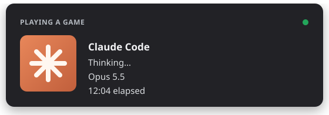

<div align="center">

# Discord Presence for Claude Code

**Show the world what Claude is building.**
A zero-dependency Claude Code plugin that puts Claude's live status and model on your Discord profile.

[](https://github.com/purposewalks9/claude-code-discord-presence/actions/workflows/ci.yml)
[](https://github.com/purposewalks9/claude-code-discord-presence/releases)
[](LICENSE)
[](https://nodejs.org)
[](package.json)
[](#requirements)



</div>

---

## Features

- **Live status:** your profile shows what Claude is doing right now: *Thinking…*, *Editing app.ts*, *Running commands*, *Searching the codebase*, *Browsing the web*, *Running subagents*, *Waiting for input*.
- **Active model:** shows *Opus 5.5*, *Sonnet 5.5*, *Haiku 4.5* and so on, and updates the moment you switch with `/model`.
- **Elapsed time:** shows how long the current session has been running.
- **One presence per machine:** every terminal, IDE and desktop session (plus subagents) feeds a single status. A busy session beats an idle one, so the card always shows real work.
- **Zero setup:** no tokens, no login and no Discord developer account. It talks to the Discord app already running on your computer.
- **Zero dependencies:** plain Node.js with a built-in Discord IPC client. Nothing to `npm install`.
- **Private by design:** project names, paths, prompts and code never leave your machine.
- **Starts itself:** comes up with Claude Code, and shuts down 5 minutes after your last session closes.

## Installation

Run these inside Claude Code:

```text
/plugin marketplace add purposewalks9/claude-code-discord-presence
/plugin install discord-presence@discord-presence
```

Restart Claude Code and send a message. Your Discord status updates within a few seconds.

### Requirements

| | |
|---|---|
| **Discord** | The desktop app, running on the same computer. The browser version can't show Rich Presence. |
| **Node.js** | 18 or newer. It's found automatically through nvm, volta, fnm, asdf or Homebrew. |
| **Activity sharing** | Discord → *User Settings* → *Activity Privacy* → **Share your detected activities with others** must be on. |
| **OS** | Linux (including Flatpak, Snap and Vesktop Discord), macOS or Windows (with Git for Windows' `sh`). |

## Usage

The plugin works with no setup. Use the slash command to check on it or change settings:

| Command | Description |
|---|---|
| `/discord-presence:presence` | Show status: daemon, connection, current state and settings |
| `/discord-presence:presence restart` | Reconnect to Discord |
| `/discord-presence:presence off` | Turn the presence off and clear your status |
| `/discord-presence:presence on` | Turn the presence back on |
| `/discord-presence:presence demo 60` | Cycle through every state for 60 seconds, to preview the card |
| `/discord-presence:presence set <key> <value>` | Change a setting (see below) |

## Configuration

Settings are stored in `~/.claude/discord-presence/config.json` and survive plugin updates.

| Key | Default | Description |
|---|---|---|
| `enabled` | `true` | Master switch |
| `activityType` | `playing` | The word before *Claude Code*: `playing`, `watching`, `listening` or `competing` |
| `showFiles` | `true` | Show file names (*Editing app.ts*) or keep them generic (*Editing code*) |
| `smallImages` | `false` | Per-state corner icons; needs matching art assets on the Discord app |
| `clientId` | shared app | Use your own Discord application, with your own name and artwork |
| `largeImage` | `claude` | Art asset key for the large image |
| `largeText` | `Claude Code` | Hover text for the large image |

For example, to hide file names:

```text
/discord-presence:presence set showFiles false
```

## Privacy

Discord receives three things: the **current action** (with the file name, unless `showFiles` is off), the **model name** and the **session start time**.
It never receives project names, paths, prompts, code or output. The plugin only talks to the Discord app on your own machine and makes no network requests of its own.

## How it works

```text
 Claude Code sessions ──hooks──▶ ~/.claude/discord-presence/sessions/*.json
                                              │
                                              ▼
                                   presence daemon (one per machine)
                                              │  local IPC socket
                                              ▼
                                       Discord desktop app
```

1. Claude Code hooks (`SessionStart`, `UserPromptSubmit`, `PreToolUse`, `PostToolUse`, `Stop`, `Notification`, `SessionEnd`) record each session's state in a small JSON file.
2. A background daemon picks the session to show: the newest one that's working, or the newest idle one if none are. It then sends that session to Discord through the local IPC socket.
3. The daemon exits 5 minutes after the last session closes. The next hook starts it again.

## Troubleshooting

<details>
<summary><b>Nothing shows on my profile</b></summary>

1. Run `/discord-presence:presence` and read the log lines it prints.
2. `Discord IPC socket not found` means the Discord **desktop** app isn't running.
3. Check that *Share your detected activities with others* is on in *Activity Privacy*.
4. Your Discord status must not be *Invisible*.

</details>

<details>
<summary><b>The status is stuck or out of date</b></summary>

Run `/discord-presence:presence restart`.

</details>

<details>
<summary><b>Can it say "Developing" instead of "Playing"?</b></summary>

No. Discord only allows *Playing*, *Watching*, *Listening to* and *Competing in*. The VS Code presence extensions are limited the same way. Use `activityType` to pick one.

</details>

<details>
<summary><b>Do I need to log in or create a Discord app?</b></summary>

No. The plugin uses a shared Discord application and your already-running Discord client. If you want a custom name or artwork, create your own app at the [Discord Developer Portal](https://discord.com/developers/applications) and set `clientId`.

</details>

## Uninstall

```text
/plugin uninstall discord-presence@discord-presence
```

Then delete `~/.claude/discord-presence/`.

## Contributing

Contributions are welcome. Read **[CONTRIBUTING.md](CONTRIBUTING.md)** for the project layout, the development workflow and the steps to add a new status. All changes go through pull requests and must pass CI.

Please follow our [Code of Conduct](CODE_OF_CONDUCT.md), and report vulnerabilities as described in [SECURITY.md](SECURITY.md).

## License

[MIT](LICENSE) © purposewalks9

<sub>This is a community project, not affiliated with or endorsed by Anthropic or Discord. "Claude" is a trademark of Anthropic, PBC. "Discord" is a trademark of Discord Inc.</sub>
